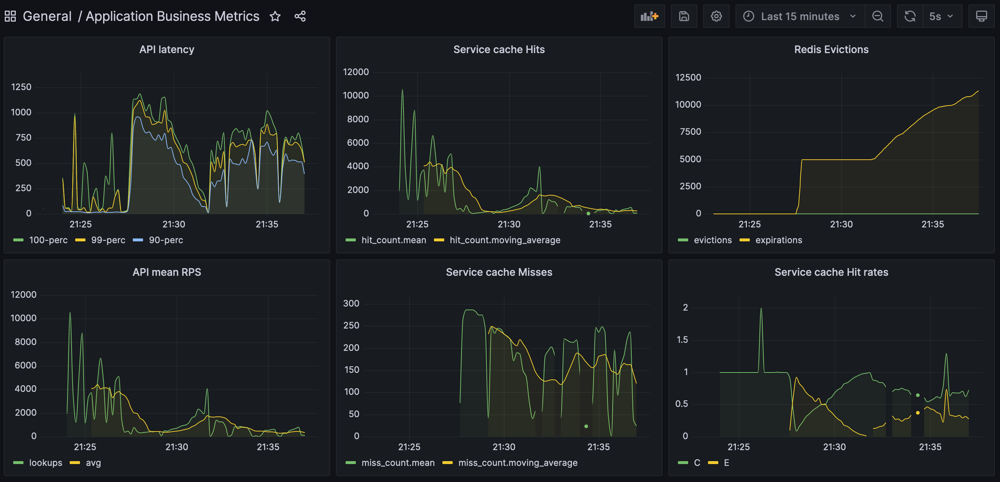

# Highload Software Architecture 8 Lesson 12 Homework

NoSQL Databases: Redis
---

## Test project setup

The demo is written in Kotlin/Quarkus with reactive approach, and uses Redis cluster for caching.

The Redis cluster includes master, slave and sentinel nodes. Monitoring of Redis and service is done with a TIG stack.

There is no database in the project, all data is generated on the fly, using a custom delay to simulate a database query.
The service works with `Person` entities, each having an `id` and some filling data. The filling data is generated randomly.
To simulate real load, the service uses groups of entities of different sizes, each having a different probability of being used.
In my setup, I used the following configuration in `application.yml`:

```yaml
app:
  entity-group-sizes: "10000, 90000"
  entity-group-probabilities: "0.9, 0.1"
  prepopulate-percentage: 25
```

to generate 10000 entities with 90% probability and 90000 entities with 10% probability.

The `prepopulate-percentage` property determines the percentage of entities to be pre-populated in the cache. In my setup, I limited Redis
with 100Mb of memory, so I pre-populated only 25% of entities to initially fill it up to 90Mb.

The load is generated by `siege` using single endpoint:

- `GET /person/random?distributed=true&probabilistic=true` - searches for an entity with the key picked randomly from the pool. If the entity is found in the cache, it's returned. If not, it's generated and saved to the cache. The `distributed` query parameter is used to determine the way the key is picked from the pool. If `distributed` is `true`, the key is picked from the pool according to the probabilities defined in `entity-group-probabilities` property. If `distributed` is `false`, the key is picked uniformly from the pool. The `probabilistic` query parameter is used to deal with key expiration. If `probabilistic` is `true`, the key may be updated in the cache with an exponential probability to the remaining time to its expiration. If `probabilistic` is `false`, the key is not updated in the cache.

## How to run

During the testing, I used different Redis configurations to see how it affects the performance. All configurations are defined in `docker-compose.yml` file.

```shell script
# Use image from Docker Hub
docker-compose up -d
# Run load test
siege -d -c 10 -t 10m "http://localhost:8080/person/random?distributed=true&probabilistic=true"
```

## How to build

The project **Requires Java 17+** to build.

```shell script
./gradlew build && \
docker build -f src/main/docker/Dockerfile -t ssamoilenko/hsal12-redis .
```

You can also run application in dev mode that enables live coding using:

```shell script
./gradlew quarkusDev
```

## Results

### Testing Redis with eviction policy set to `noeviction`

The `noeviction` policy disabled automatic eviction of keys when the memory limit is reached.

This caused OOM as soon as the cache was filled up to 100Mb: `Request failed: OOM command not allowed when used memory > 'maxmemory'.`


### Testing Redis with eviction policy set to `allkeys-lru`

The `allkeys-lru` policy evicts the least recently used keys when the memory limit is reached.

The result is pretty good, the optimal cache usage was reached in 10 minutes.


### Testing Redis with eviction policy set to `allkeys-random`

The `allkeys-random` policy evicts random keys when the memory limit is reached.

The result is also good, but worse than with `allkeys-lru` policy.


### Testing Redis with eviction policy set to `allkeys-lfu`

The `allkeys-lfu` policy evicts the least frequently used keys when the memory limit is reached.

This gave the best result, the optimal cache usage was reached faster than with other policies.


### Testing Redis with cache TTL of 4 minutes without using probabilistic updates

To test this behavior, I reduced number of entities to 5000 and set cache pre-population to 100%. I also wasn't using custom random distribution for keys.

This resulted in a huge latency spike, which was caused by the cache eviction. It took time to re-populate the cache and finally return to normal performance.



### Testing Redis with cache TTL of 4 minutes using probabilistic updates

Test setup was as in the previous test, but I was using probabilistic updates. (see `com.example.service.PersonCacheService.getOrComputeProbabilistic()` method)

In this case, the latency spiked much steeply, but the final performance was the same as in the previous test, because both setups ended with populating the cache at the same rate.


